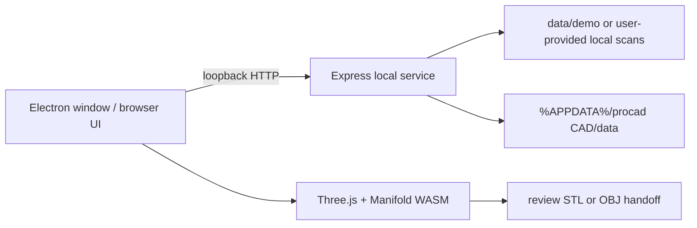

# procad CAD architecture

procad is a local desktop wrapper around a loopback web application. The renderer owns the interactive 3D scene and review controls. The local service owns file intake, SHA-256 provenance, case JSON, approval records, and review-proposal persistence. Surface meshes are accepted in STL/PLY/OBJ/OFF; point clouds are accepted in XYZ/PTS/CSV/ASCII PCD for inspection and registration preparation. A packaged Electron process chooses a free loopback port, starts the service as a child process, waits for `/api/health`, and then opens the same UI used in development.

The current geometry slice is deliberately narrow: one preparation, one opposing scan, one optional arch, and one single-crown Boolean preview. The inner surface comes from a preparation solid; the outer surface comes from the reference-placement path or the closed procedural fallback. Mesh integrity checks gate export, but the review acknowledgement does not turn the result into a clinical or CAM approval.

The current approval gate fingerprints a saved proposal and its canonical design context, independently validates the saved closed proposal on the local service, then receives and hashes the exact STL/OBJ artifact before creating a local JSON CAM handoff manifest. It does not transmit to a machine or create a toolpath. The next engineering gates are a verified scan registration record, an editable three-dimensional margin, an insertion-axis and undercut report, separate intaglio zones with measured clearances, signed occlusion/contact maps, material and machine profiles, and machine-specific CAM validation. Each gate needs dental-lab review cases and documented acceptance tolerances before it can be enabled for manufacturing output.

The public repository ships only an original synthetic box fixture so a fresh clone has a deterministic demo. A local `BlueSky_Crown_Practice` directory may still be selected through the existing local environment path, but that dataset is intentionally excluded from public version control.
